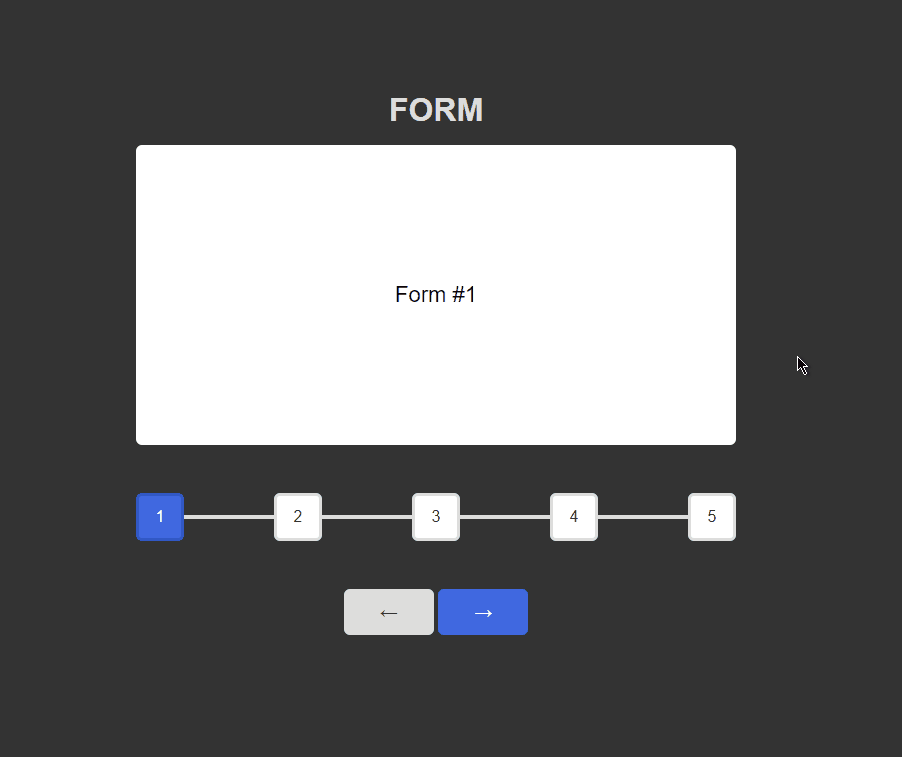

# Website Components

Website Components created by Patryk 'UltiPro' Wójtowicz using JavaScript, CSS and HTML.

Simple components.

> Components implemented from Mateusz Maj's course.

# Preview

### Accordion

### Animated Text

### Color Field

### Cookie Alert

### Draggable Items

### Form Progress Bar

### Navbar With Search Animation

### Pulsing Button

### Scrollbar

### Scrollspy

### Slider

### Timeline

### Unfolding Slider

### Website Counters

### Zoom Images

